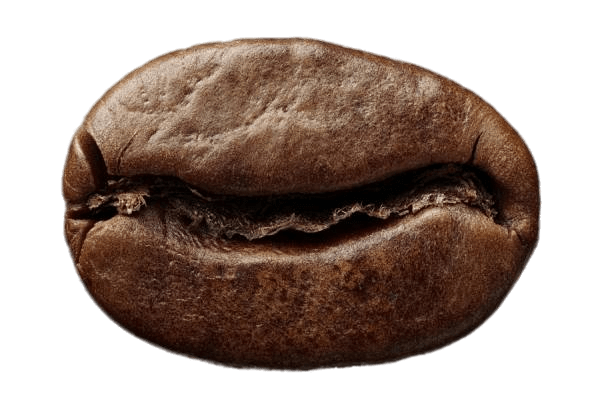

# Weekly Coffee Convos

---

## [Pumpkin Spiced Lattes are back!](pumpkin-lattes-back.md)

Starting today, you don't have to wait for the autumn or fall months ...

  

## [Tips and Tricks to Different Brewing Methods](tips-and-tricks.md)

There are a lot of different brewing methods, tricks, and tips to ...

  

## [Master the Perfect Vanilla Latte](master-vanilla-latte.md)

Making that perfect cup of a comforting vanilla latte isn't as hard ...

